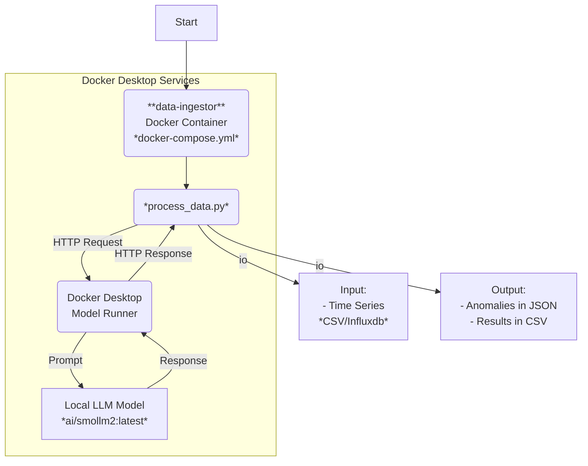

```mermaid
graph TD
    A[Start] --> A1(**data-ingestor**<br>Docker Container<br>*docker-compose.yml*);
    A1 --> B(*process_data.py*)
    B -- io --> D1[Input:<br>- Time Series <br>*CSV/Influxdb*];
    B -- HTTP Request --> C(Docker Desktop<br> Model Runner);
    C -- HTTP Response --> B;
    B -- io --> D[Output:<br>- Anomalies in JSON<br>- Results in CSV];
	C -- "Prompt" --> E["Local LLM Model<br>*ai/smollm2:latest*"];
	E -- "Response"--> C
    subgraph "Docker Desktop Services"
        A1
        C
        B
        E
    end
```

